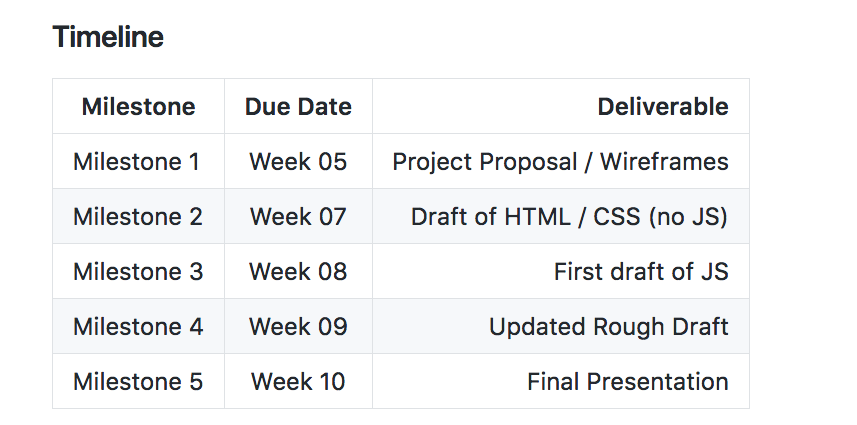

# fewd-chi-october-2019
Class repo for FEWD

## Class Schedule

> - Tuesdays + Thursdays, 6-9PM
> - 10/29/2019 - 1/16/2020
> - **Holidays**
>   - 11/28
>   - 12/24
>   - 12/26
>   - 12/31

## Syllabus + Milestones

### Milestones

### Week 1

> - Introduction
> - Git, Github, Github desktop
> - Intro to HTML
> - Intro to CSS
> - Intro to VSCode
> - Basics of the Internet

### Week 2
> - HTML + CSS (con't)
> - Resets
> - Box Model
> - Box-sizing
> - Layouts
>   - Float
>   - Flexbox
>   - Layout Lab

### Week 3
> - HTML + CSS (con't)
> - Layouts (con't)
>   - Flexbox
>   - CSS Grid

### Week 4
> - HTML + CSS (con't)
> - Layouts (con't)
>   - Flexbox
>   - CSS Grid
> - Responsive CSS
>   - @media queries
> - Blog Build Lab

### Week 5

> **Milestone due**:
> Final Project Proposals +
> Wireframes

> - Intro to JavaScript
> - JavaScript Fundamentals
> - Programmatic Thinking
> - Primitive Data Types

### Week 6

> - JavaScript (con't)
>   - Functions
>   - Arrays
>   - Objects
> - Document Object Model (DOM) traversal + manipulation

### Week 7

> **Milestone due**:
> Draft of HTML / CSS (no JS) +
> Wireframes

> JavaScript (con't)
>   - Document Object Model (DOM) traversal + manipulation (con't)
>   - Events
>   - Event Listener Lab Parts 1 + 2
>     - Planet Discovery
>     - Mobile Navigation Lab

### Week 8

> **Milestone due**:
> First draft of JavaScript

> - JavaScript (con't)
>   - XMLHttpRequests
>     - JSON (JavaScript Object Notation)
> - HTML Forms
>   - Styling Form elements
>   - Native Input Validation
>   - JavaScript Input Validation

### Week 9

> **Milestone due**:
> Updated rough draft of final project

> - Advanced CSS
>   - transitions
>   - @keyframe animations
>   - stepped animations
> - Final Project In-class Lab

### Week 10
> **Milestone due**:
> Final Project Presentation
